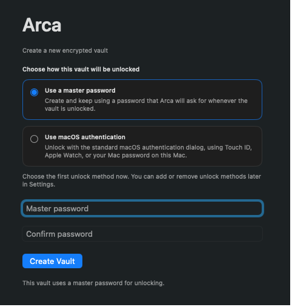

# Arca

[English README](./README.md)



Arca は、Keychain Access の昔ながらの Secure Notes ワークフローを置き換えるための、シンプルな macOS 向けアプリです。

Secure Notes の「速い」「秘匿できる」「余計なことをしない」という使い心地が好きだった人向けに、Arca はその感覚を今の macOS で続けられるように作られています。1 ノート 1 ファイル、iCloud Drive と相性のよい安全な保存方式、そしてノートアプリというよりユーティリティに近い静かな UI が特徴です。

## Arca の特徴

- 静かで馴染みやすい: フル機能のノートアプリではなく、Keychain 風の落ち着いたレイアウト
- 壊れにくさ優先: 1 ノート 1 ファイル、atomic write、tombstone、競合コピー保持
- 保存時も秘匿: マスターパスワードによる AES-256-GCM 暗号化
- すばやく使える: 解除、検索、編集、ロックがすぐ終わる
- 現代的な利便性: 一度マスターパスワードで解除すれば、対応 Mac ではローカルな生体認証解除も利用可能

## できること

- セキュアなテキストノートの作成、編集、削除、検索
- 利用可能な場合は iCloud Drive ベースの vault へ保存
- 競合が起きても上書きせず、コピーを保持
- 壊れたファイルがあっても vault 全体を壊さずにスキップ
- 一定時間の非操作で自動ロック
- 単一ウィンドウ・単一起動のユーティリティ挙動

## 保存場所

Arca はデフォルトで次の場所にノートを保存します。

- iCloud Drive が利用できる場合: `~/Library/Mobile Documents/com~apple~CloudDocs/ArcaVault`
- それ以外: `~/Library/Application Support/ArcaVault`

## 実行

```bash
swift run
```

標準的な `.app` バンドルとして扱いたい場合や、macOS 連携をさらに広げたい場合は、Xcode でこの Package を開いてください。
