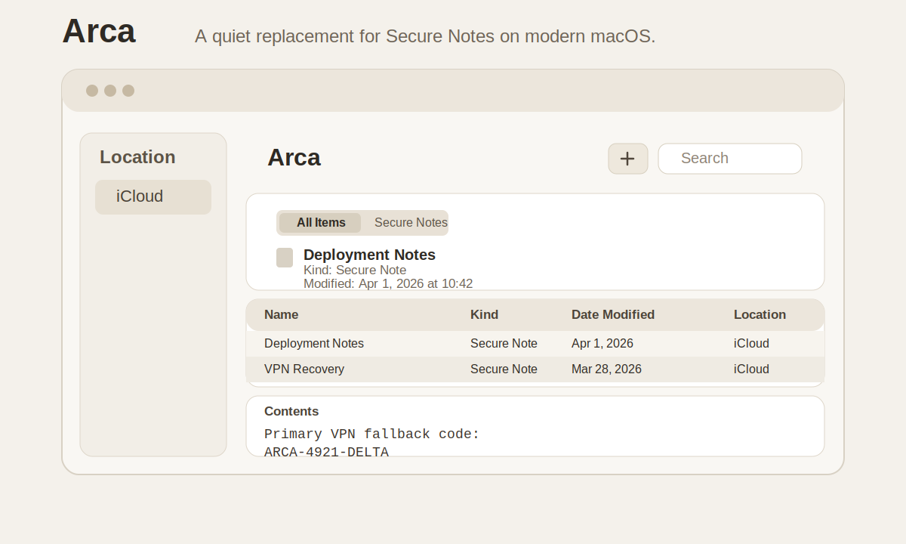

# Arca

[日本語版 README](./README.ja.md)



Arca is a simple replacement for the old Secure Notes workflow in Keychain Access.

If you used Secure Notes because it was fast, private, and stayed out of your way, Arca is built for that exact habit: one note per encrypted file, safe iCloud-friendly storage, and a calm macOS-native interface that feels closer to a utility than a notebook app.

## Why Arca

- Quiet and familiar: a Keychain-like layout for people who do not want a full notes app
- Durable by design: one note per file, atomic writes, tombstones, and conflict preservation
- Private on disk: AES-256-GCM encrypted note files with a master password
- Fast to use: unlock, search, edit, lock
- Modern convenience: optional biometric local unlock on supported Macs after first password unlock

## What It Does

- Create, edit, delete, and search secure text notes
- Store notes in an iCloud Drive-backed vault when available
- Preserve conflicting copies instead of silently overwriting data
- Skip malformed files without breaking the whole vault
- Auto-lock after inactivity
- Enforce a single app window and a single running instance

## Vault Location

Arca stores notes here by default:

- `~/Library/Mobile Documents/com~apple~CloudDocs/ArcaVault` when iCloud Drive is available
- `~/Library/Application Support/ArcaVault` otherwise

## Run

```bash
swift run
```

Open the package in Xcode if you want to turn it into a standard `.app` bundle or extend the macOS integration further.
